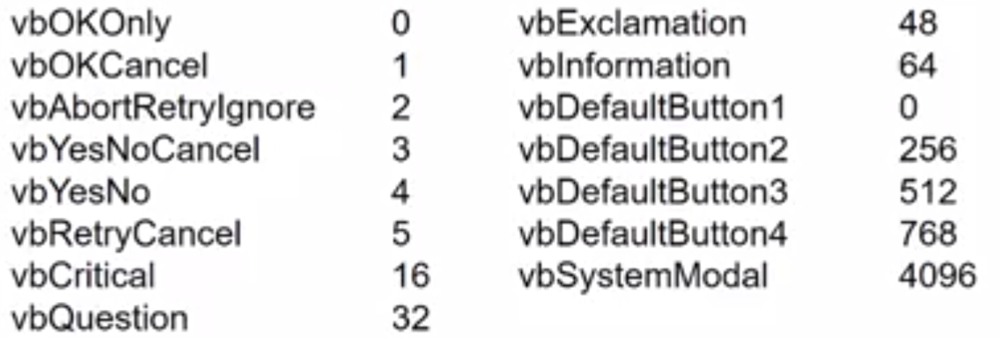
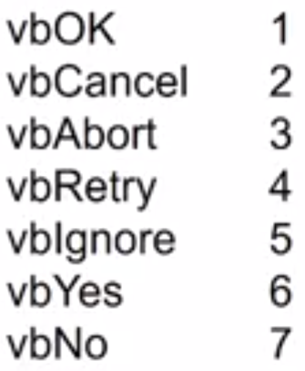

# Frequent Functions
```vbscript
decimal_1_place = FormatNumber(decimal_num, 1)
IsNumeric(input_string)
1 * input_string1 > 1 * input_string2        'converts the string to number if possible, just in case it does not
n = WorksheetFunction.CountA(Columns("A:A"))    'counts the number of non-null items in the column A
Public n As Integer             'shared with other subroutines, unlike `Dim n As Integer`

Application.ScreenUpdating = False      'screen does not flash, good whenever it needs to switch workbooks and sheets
Application.DisplayAlerts = False       'Continue to run without showing notifications
On Error Resume Next        'ignore when there is error
```

# 
## Input Box
```vbscript
Dim x As Variant    'Variant type so that less error scenario
x = Application.InputBox(prompt:="Appears beside question", Title:="Title of box", Default:=0, Type:=3)    'InputBox method
x = InputBox("Appears beside question", "Title of box", 0)      'InputBox function cannot specify Type
```

`Type` has input validation, returning `False` if fail
- 0: formula
- 1: number
- 2: string
- 4: logical
- 8: cell reference
- 16: error
- 64: array of values

`x=""` if press cancel button (provided it passes `Type` input validation)


## Msg Box
```vbscript
x = MsgBox("prompt", "button")
```

Button code



MsgBox returns value when the function uses params other than prompt




# User Form
## Quit form
```vbascript
Form1.Hide
Unload Form1
```

## Reset form
```vbascript
Unload Form1
Form1.Show
```

## Use Variables
State variable by the name of the item attribute name in the UserForm, but **do not Dim** it in the Sub. Only Dim new temporary variables.

## Combo Box
```vbascript
UserForm1.ComboBox1.AddItem "ItemName"
UserForm1.ComboBox1.Text = "Default value"
UserForm1.ComboBox1.ListIndex       'returns 0-indexed value
```