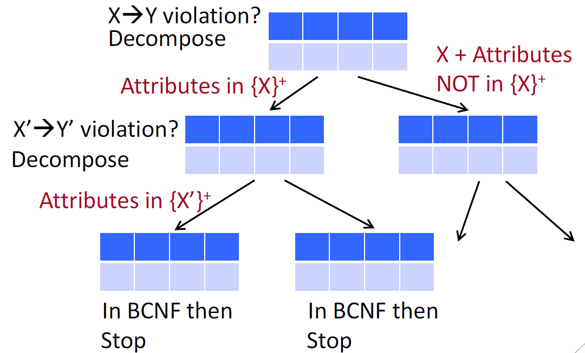

<h1>Introduction to Databases (lessons from CZ2007/2021 Sem 1)</h1>

- [0 Glossary](#0-glossary)
- [1 Functional Dependencies](#1-functional-dependencies)
- [2 Normal Forms](#2-normal-forms)
  - [First NF](#first-nf)
  - [Second NF](#second-nf)
  - [Third NF](#third-nf)
  - [Boyce-Codd NF](#boyce-codd-nf)
    - [Properties](#properties)

# 0 Glossary
1. Superkey: superset of key, may contain insignificant attributes in it
2. Key: cleanest (smallest) superkey
   - Key attribute: an attribute that is part of the key (if the key has >1 attr)
3. Candidate Keys: all possible keys
4. Primary vs secondary keys: both types belong to candidate keys. Just pick one set to be primary

# 1 Functional Dependencies
Consequences of bad db schema design (also no normalisation): data inconsistency and duplicates when wrong columns become the primary key
1. Redundancy
2. Deletion, update, insertion anomalies

# 2 Normal Forms
4th-6th NF are the strictest, but 3rd NF and BCNF are mostly used

## First NF
All attributes (columns) are atomic

## Second NF
Every non-key attribute must depend on the whole of **every** candidate key.

Problem: `non-key-attr -> non-key-attr` FD also passes.

## Third NF
Relaxation of BCNF: decompositions **always prefer FDs**

Is Normal Form?
- LHS contains key or
- Each attr in RHS belongs to a key

## Boyce-Codd NF
Is Normal Form?
- LHS of **each given** FD contains a key (any of the candidate keys)

Conversion to BCNF
1. Test for violation of BCNF for each FD on table R
   - Method 1: LHS of `X->Y` must contain key. Problem arises in subtables when X contains some attr in subtable but Y contains some not in subtable. So,
   - Method 2: Closure(`X`) must contain all attr of subtable, if the FD from {X}+ = {Y} is not reflexive (ie Y contains more attr than X)
2. Found violation (ie LHS no key)? Find {LHS}+ ie `Closure(LHS of this FD)` to be subtable R2, whereas subtable R1 is `R - Closure(LHS)`
3. Split R to R1 and R2. Repeat from Step 1 for both tables

### Properties
Pros
1. No update or deletion anomalies
2. Very small redundancy
3. Lossless join property: original table reconstructable

Cons
1. May not preserve all FDs