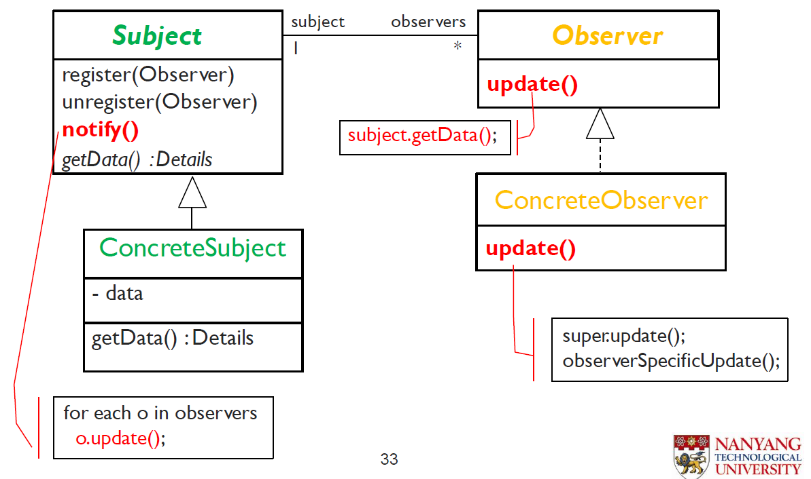
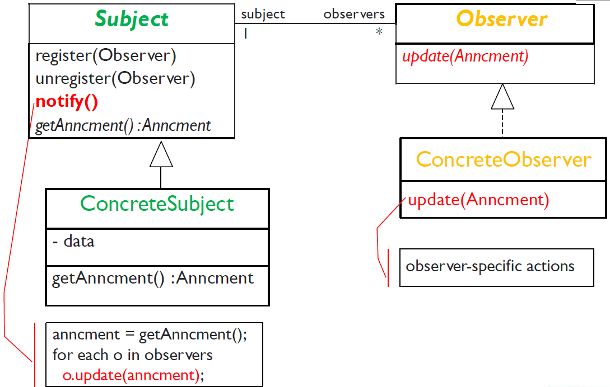
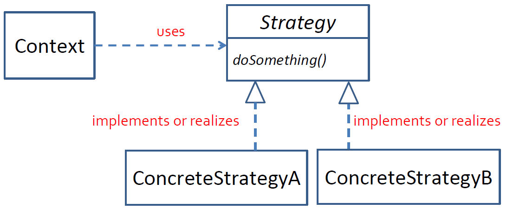

<h1>Software Patterns</h1>

- [Non-GoF](#non-gof)
  - [Data Transfer Objects (DTO)](#data-transfer-objects-dto)
- [Behavioural](#behavioural)
  - [Observer](#observer)
  - [Strategy](#strategy)
  - [Mediator](#mediator)
  - [Memento](#memento)
  - [State](#state)
- [Structural](#structural)
  - [Adapter](#adapter)
  - [Facade](#facade)
- [Creational](#creational)
  - [Builder](#builder)
  - [Prototype](#prototype)

# Non-GoF 
## Data Transfer Objects (DTO)

# Behavioural
## Observer
- Feature: Easy subscription, automatic notification
  - Interest subscription, selective notification (only notify observers interested in this event)
- Design Problem: Loose coupling between subject (event source) and observers (event handlers)
  - Event source is bursty, event handler wants liberty
- For: Event-driven architecture

Pull update (2-way communication)

Push update (1-way)

## Strategy
- Feature: The algo or objects **used** should be **interchangeable**
- For: plenty of possible techniques to solve a task

## Mediator

## Memento

## State

# Structural
## Adapter

## Facade

# Creational
## Builder

## Prototype

